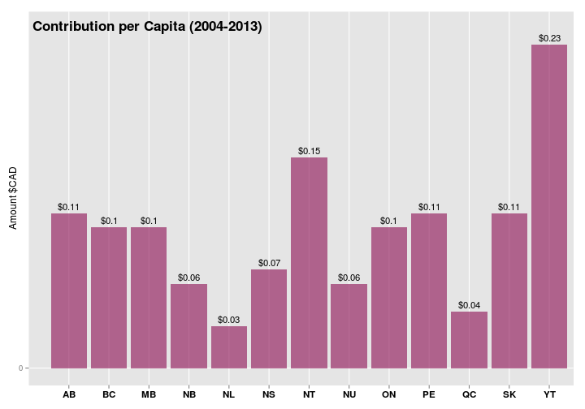

 

## Synopsis

On the [Datathon](http://www.meetup.com/DataforGood/events/218482002/) organized by [Data4Good](http://www.meetup.com/DataforGood/) in December 2014, the theme was to analyze the data of Election Canada related to donations to various political parties. This is the analysis results of our team:

- [Tri Nguyen](mailto:tritanix@gmail.com?Subject=Datathon%20Election%20Canada)
- Terry Lin
- Mohamed Ismail
- Wesley Li
- Elise Nguyen

## Source Data

The Dataset contains the records of donations to 5 major political parties across all Canada covering the period 2004 - 2013:

- Original data at [Elections Canada](http://www.elections.ca/WPAPPS/WPF/EN/EDA/SelectAssociations?act=C2&part=OBS&returntype=1&option=11)

- Pre-processed data by [https://github.com/leonL/federal-contributions-munging](https://github.com/leonL/federal-contributions-munging/tree/master/munged_data)

 

The pre-processed data has done a major cleanup of the orginal data. The data we use for this analysis is the `all_contributions_2004_to_2013.csv` file generated by the script [concatenate_all_csvs.R](https://github.com/leonL/federal-contributions-munging/blob/master/munged_data/concatenate_all_csvs.R) on 2014-12-17. For convenience, the CSV file is supplied in [bz2 compressed format](../all_contributions_2004_to_2013.csv.bz2) along with this document. 
The CSV file still suffers some minor data quality issues, but is largely usable to conduct the analysis:

 

| Info |  Description |
|-------|----------|
| CSV Size | 283 MB (uncompressed size, All provinces, period 2004 - 2013) |
| Total records | 1,633,883 |
| Province | 4572 Unknown (0.3%). After extra cleanup, it remains 1958 (0.1%) unknown province codes, accounting for $540K donation |
| Cities | 1419 missing city names |
| . | We have made an extra cleanup and have been able to recover most of the missing province codes and to fix the names for the most important cities |
| Contributor "Home" Riding Names | 92,541 missing (5.6%) |
| "Target" Riding Names| 1,452,448 missing (88.8%) |
| . | The riding names are severely missing. The analysis results related to Ridings are mostly inaccurate. However, the analysis code is generic and can be reapplied at a later time on higher quality data.|
| contributor_id | 240,235 unique contributors, 0 missing. This is just to emphasize that the **contributor_id** is critical to the accuracy of this analysis. Because almost every result in this analysis is based on various counts of contributors. Care must be taken to determine this ID in the pre-processed data |

## Analysis Results

**1. Tax Credits** How much public money pumped into the system each year

 

[Tax Calculation Rules](http://www.elections.ca/content.aspx?section=res&dir=ces&document=part6&lang=e),
Section "Tax Credits for Political Contributions"

<table id="kab1">
<caption>Contribution vs Tax Credits</caption>
 <thead>
  <tr>
   <th style="text-align:left;"> Year </th>
   <th style="text-align:right;"> YearAmt (million) </th>
   <th style="text-align:right;"> YearTaxCredits (million) </th>
   <th style="text-align:left;"> Ratio </th>
  </tr>
 </thead>
<tbody>
  <tr>
   <td style="text-align:left;"> 2004 </td>
   <td style="text-align:right;"> 19.69 </td>
   <td style="text-align:right;"> 14.77 </td>
   <td style="text-align:left;"> 75% </td>
  </tr>
  <tr>
   <td style="text-align:left;"> 2005 </td>
   <td style="text-align:right;"> 28.69 </td>
   <td style="text-align:right;"> 21.52 </td>
   <td style="text-align:left;"> 75% </td>
  </tr>
  <tr>
   <td style="text-align:left;"> 2006 </td>
   <td style="text-align:right;"> 26.12 </td>
   <td style="text-align:right;"> 19.59 </td>
   <td style="text-align:left;"> 75% </td>
  </tr>
  <tr>
   <td style="text-align:left;"> 2007 </td>
   <td style="text-align:right;"> 21.73 </td>
   <td style="text-align:right;"> 16.30 </td>
   <td style="text-align:left;"> 75% </td>
  </tr>
  <tr>
   <td style="text-align:left;"> 2008 </td>
   <td style="text-align:right;"> 32.19 </td>
   <td style="text-align:right;"> 24.14 </td>
   <td style="text-align:left;"> 75% </td>
  </tr>
  <tr>
   <td style="text-align:left;"> 2009 </td>
   <td style="text-align:right;"> 28.31 </td>
   <td style="text-align:right;"> 21.23 </td>
   <td style="text-align:left;"> 75% </td>
  </tr>
  <tr>
   <td style="text-align:left;"> 2010 </td>
   <td style="text-align:right;"> 26.56 </td>
   <td style="text-align:right;"> 19.85 </td>
   <td style="text-align:left;"> 75% </td>
  </tr>
  <tr>
   <td style="text-align:left;"> 2011 </td>
   <td style="text-align:right;"> 38.12 </td>
   <td style="text-align:right;"> 28.57 </td>
   <td style="text-align:left;"> 75% </td>
  </tr>
  <tr>
   <td style="text-align:left;"> 2012 </td>
   <td style="text-align:right;"> 27.83 </td>
   <td style="text-align:right;"> 20.76 </td>
   <td style="text-align:left;"> 75% </td>
  </tr>
  <tr>
   <td style="text-align:left;"> 2013 </td>
   <td style="text-align:right;"> 29.71 </td>
   <td style="text-align:right;"> 21.93 </td>
   <td style="text-align:left;"> 74% </td>
  </tr>
  <tr>
   <td style="text-align:left;"> TOTAL </td>
   <td style="text-align:right;"> 278.94 </td>
   <td style="text-align:right;"> 208.66 </td>
   <td style="text-align:left;"> 75% </td>
  </tr>
</tbody>
</table>

 

 

**2A. Regional Variation** Highest Contributing Cities

 

<table id="kab2">
<caption>Top50 Contributing Cities in Canada (2004-2013)</caption>
 <thead>
  <tr>
   <th style="text-align:right;"> RankByAmount </th>
   <th style="text-align:left;"> city </th>
   <th style="text-align:left;"> province </th>
   <th style="text-align:right;"> AmountKCAD </th>
   <th style="text-align:right;"> ContribCount </th>
   <th style="text-align:right;"> RankByCount </th>
   <th style="text-align:left;"> AvgAmtByContrib </th>
  </tr>
 </thead>
<tbody>
  <tr>
   <td style="text-align:right;"> 1 </td>
   <td style="text-align:left;"> TORONTO </td>
   <td style="text-align:left;"> ON </td>
   <td style="text-align:right;"> 269 </td>
   <td style="text-align:right;"> 125071 </td>
   <td style="text-align:right;"> 1 </td>
   <td style="text-align:left;"> $2 </td>
  </tr>
  <tr>
   <td style="text-align:right;"> 2 </td>
   <td style="text-align:left;"> CALGARY </td>
   <td style="text-align:left;"> AB </td>
   <td style="text-align:right;"> 153 </td>
   <td style="text-align:right;"> 78242 </td>
   <td style="text-align:right;"> 2 </td>
   <td style="text-align:left;"> $2 </td>
  </tr>
  <tr>
   <td style="text-align:right;"> 3 </td>
   <td style="text-align:left;"> OTTAWA </td>
   <td style="text-align:left;"> ON </td>
   <td style="text-align:right;"> 133 </td>
   <td style="text-align:right;"> 77822 </td>
   <td style="text-align:right;"> 3 </td>
   <td style="text-align:left;"> $2 </td>
  </tr>
  <tr>
   <td style="text-align:right;"> 4 </td>
   <td style="text-align:left;"> VANCOUVER </td>
   <td style="text-align:left;"> BC </td>
   <td style="text-align:right;"> 94 </td>
   <td style="text-align:right;"> 49316 </td>
   <td style="text-align:right;"> 5 </td>
   <td style="text-align:left;"> $2 </td>
  </tr>
  <tr>
   <td style="text-align:right;"> 5 </td>
   <td style="text-align:left;"> EDMONTON </td>
   <td style="text-align:left;"> AB </td>
   <td style="text-align:right;"> 91 </td>
   <td style="text-align:right;"> 62060 </td>
   <td style="text-align:right;"> 4 </td>
   <td style="text-align:left;"> $1 </td>
  </tr>
  <tr>
   <td style="text-align:right;"> 6 </td>
   <td style="text-align:left;"> MONTREAL </td>
   <td style="text-align:left;"> QC </td>
   <td style="text-align:right;"> 77 </td>
   <td style="text-align:right;"> 22328 </td>
   <td style="text-align:right;"> 8 </td>
   <td style="text-align:left;"> $3 </td>
  </tr>
  <tr>
   <td style="text-align:right;"> 7 </td>
   <td style="text-align:left;"> WINNIPEG </td>
   <td style="text-align:left;"> MB </td>
   <td style="text-align:right;"> 73 </td>
   <td style="text-align:right;"> 49186 </td>
   <td style="text-align:right;"> 6 </td>
   <td style="text-align:left;"> $1 </td>
  </tr>
  <tr>
   <td style="text-align:right;"> 8 </td>
   <td style="text-align:left;"> VICTORIA </td>
   <td style="text-align:left;"> BC </td>
   <td style="text-align:right;"> 44 </td>
   <td style="text-align:right;"> 34196 </td>
   <td style="text-align:right;"> 7 </td>
   <td style="text-align:left;"> $1 </td>
  </tr>
  <tr>
   <td style="text-align:right;"> 9 </td>
   <td style="text-align:left;"> MISSISSAUGA </td>
   <td style="text-align:left;"> ON </td>
   <td style="text-align:right;"> 42 </td>
   <td style="text-align:right;"> 18479 </td>
   <td style="text-align:right;"> 11 </td>
   <td style="text-align:left;"> $2 </td>
  </tr>
  <tr>
   <td style="text-align:right;"> 10 </td>
   <td style="text-align:left;"> NORTH YORK </td>
   <td style="text-align:left;"> ON </td>
   <td style="text-align:right;"> 36 </td>
   <td style="text-align:right;"> 17278 </td>
   <td style="text-align:right;"> 13 </td>
   <td style="text-align:left;"> $2 </td>
  </tr>
  <tr>
   <td style="text-align:right;"> 11 </td>
   <td style="text-align:left;"> LONDON </td>
   <td style="text-align:left;"> ON </td>
   <td style="text-align:right;"> 33 </td>
   <td style="text-align:right;"> 21883 </td>
   <td style="text-align:right;"> 9 </td>
   <td style="text-align:left;"> $2 </td>
  </tr>
  <tr>
   <td style="text-align:right;"> 12 </td>
   <td style="text-align:left;"> SASKATOON </td>
   <td style="text-align:left;"> SK </td>
   <td style="text-align:right;"> 30 </td>
   <td style="text-align:right;"> 21525 </td>
   <td style="text-align:right;"> 10 </td>
   <td style="text-align:left;"> $1 </td>
  </tr>
  <tr>
   <td style="text-align:right;"> 13 </td>
   <td style="text-align:left;"> SURREY </td>
   <td style="text-align:left;"> BC </td>
   <td style="text-align:right;"> 29 </td>
   <td style="text-align:right;"> 16176 </td>
   <td style="text-align:right;"> 14 </td>
   <td style="text-align:left;"> $2 </td>
  </tr>
  <tr>
   <td style="text-align:right;"> 14 </td>
   <td style="text-align:left;"> BRAMPTON </td>
   <td style="text-align:left;"> ON </td>
   <td style="text-align:right;"> 29 </td>
   <td style="text-align:right;"> 10476 </td>
   <td style="text-align:right;"> 23 </td>
   <td style="text-align:left;"> $3 </td>
  </tr>
  <tr>
   <td style="text-align:right;"> 15 </td>
   <td style="text-align:left;"> ETOBICOKE </td>
   <td style="text-align:left;"> ON </td>
   <td style="text-align:right;"> 27 </td>
   <td style="text-align:right;"> 14272 </td>
   <td style="text-align:right;"> 17 </td>
   <td style="text-align:left;"> $2 </td>
  </tr>
  <tr>
   <td style="text-align:right;"> 16 </td>
   <td style="text-align:left;"> REGINA </td>
   <td style="text-align:left;"> SK </td>
   <td style="text-align:right;"> 26 </td>
   <td style="text-align:right;"> 17699 </td>
   <td style="text-align:right;"> 12 </td>
   <td style="text-align:left;"> $1 </td>
  </tr>
  <tr>
   <td style="text-align:right;"> 17 </td>
   <td style="text-align:left;"> OAKVILLE </td>
   <td style="text-align:left;"> ON </td>
   <td style="text-align:right;"> 23 </td>
   <td style="text-align:right;"> 10647 </td>
   <td style="text-align:right;"> 22 </td>
   <td style="text-align:left;"> $2 </td>
  </tr>
  <tr>
   <td style="text-align:right;"> 18 </td>
   <td style="text-align:left;"> WESTMOUNT </td>
   <td style="text-align:left;"> QC </td>
   <td style="text-align:right;"> 22 </td>
   <td style="text-align:right;"> 4059 </td>
   <td style="text-align:right;"> 64 </td>
   <td style="text-align:left;"> $5 </td>
  </tr>
  <tr>
   <td style="text-align:right;"> 19 </td>
   <td style="text-align:left;"> WEST VANCOUVER </td>
   <td style="text-align:left;"> BC </td>
   <td style="text-align:right;"> 21 </td>
   <td style="text-align:right;"> 8714 </td>
   <td style="text-align:right;"> 29 </td>
   <td style="text-align:left;"> $2 </td>
  </tr>
  <tr>
   <td style="text-align:right;"> 20 </td>
   <td style="text-align:left;"> SCARBOROUGH </td>
   <td style="text-align:left;"> ON </td>
   <td style="text-align:right;"> 20 </td>
   <td style="text-align:right;"> 13817 </td>
   <td style="text-align:right;"> 18 </td>
   <td style="text-align:left;"> $1 </td>
  </tr>
  <tr>
   <td style="text-align:right;"> 21 </td>
   <td style="text-align:left;"> NEPEAN </td>
   <td style="text-align:left;"> ON </td>
   <td style="text-align:right;"> 20 </td>
   <td style="text-align:right;"> 13119 </td>
   <td style="text-align:right;"> 19 </td>
   <td style="text-align:left;"> $2 </td>
  </tr>
  <tr>
   <td style="text-align:right;"> 22 </td>
   <td style="text-align:left;"> HALIFAX </td>
   <td style="text-align:left;"> NS </td>
   <td style="text-align:right;"> 19 </td>
   <td style="text-align:right;"> 14351 </td>
   <td style="text-align:right;"> 15 </td>
   <td style="text-align:left;"> $1 </td>
  </tr>
  <tr>
   <td style="text-align:right;"> 23 </td>
   <td style="text-align:left;"> HAMILTON </td>
   <td style="text-align:left;"> ON </td>
   <td style="text-align:right;"> 18 </td>
   <td style="text-align:right;"> 14293 </td>
   <td style="text-align:right;"> 16 </td>
   <td style="text-align:left;"> $1 </td>
  </tr>
  <tr>
   <td style="text-align:right;"> 24 </td>
   <td style="text-align:left;"> NORTH VANCOUVER </td>
   <td style="text-align:left;"> BC </td>
   <td style="text-align:right;"> 18 </td>
   <td style="text-align:right;"> 10023 </td>
   <td style="text-align:right;"> 24 </td>
   <td style="text-align:left;"> $2 </td>
  </tr>
  <tr>
   <td style="text-align:right;"> 25 </td>
   <td style="text-align:left;"> KINGSTON </td>
   <td style="text-align:left;"> ON </td>
   <td style="text-align:right;"> 16 </td>
   <td style="text-align:right;"> 11420 </td>
   <td style="text-align:right;"> 21 </td>
   <td style="text-align:left;"> $1 </td>
  </tr>
  <tr>
   <td style="text-align:right;"> 26 </td>
   <td style="text-align:left;"> GATINEAU </td>
   <td style="text-align:left;"> QC </td>
   <td style="text-align:right;"> 16 </td>
   <td style="text-align:right;"> 6211 </td>
   <td style="text-align:right;"> 41 </td>
   <td style="text-align:left;"> $3 </td>
  </tr>
  <tr>
   <td style="text-align:right;"> 27 </td>
   <td style="text-align:left;"> BURNABY </td>
   <td style="text-align:left;"> BC </td>
   <td style="text-align:right;"> 15 </td>
   <td style="text-align:right;"> 12609 </td>
   <td style="text-align:right;"> 20 </td>
   <td style="text-align:left;"> $1 </td>
  </tr>
  <tr>
   <td style="text-align:right;"> 28 </td>
   <td style="text-align:left;"> BURLINGTON </td>
   <td style="text-align:left;"> ON </td>
   <td style="text-align:right;"> 15 </td>
   <td style="text-align:right;"> 9173 </td>
   <td style="text-align:right;"> 28 </td>
   <td style="text-align:left;"> $2 </td>
  </tr>
  <tr>
   <td style="text-align:right;"> 29 </td>
   <td style="text-align:left;"> LAVAL </td>
   <td style="text-align:left;"> QC </td>
   <td style="text-align:right;"> 15 </td>
   <td style="text-align:right;"> 3508 </td>
   <td style="text-align:right;"> 73 </td>
   <td style="text-align:left;"> $4 </td>
  </tr>
  <tr>
   <td style="text-align:right;"> 30 </td>
   <td style="text-align:left;"> KELOWNA </td>
   <td style="text-align:left;"> BC </td>
   <td style="text-align:right;"> 14 </td>
   <td style="text-align:right;"> 9484 </td>
   <td style="text-align:right;"> 26 </td>
   <td style="text-align:left;"> $1 </td>
  </tr>
  <tr>
   <td style="text-align:right;"> 31 </td>
   <td style="text-align:left;"> KITCHENER </td>
   <td style="text-align:left;"> ON </td>
   <td style="text-align:right;"> 14 </td>
   <td style="text-align:right;"> 9295 </td>
   <td style="text-align:right;"> 27 </td>
   <td style="text-align:left;"> $2 </td>
  </tr>
  <tr>
   <td style="text-align:right;"> 32 </td>
   <td style="text-align:left;"> THORNHILL </td>
   <td style="text-align:left;"> ON </td>
   <td style="text-align:right;"> 14 </td>
   <td style="text-align:right;"> 7107 </td>
   <td style="text-align:right;"> 33 </td>
   <td style="text-align:left;"> $2 </td>
  </tr>
  <tr>
   <td style="text-align:right;"> 33 </td>
   <td style="text-align:left;"> QUEBEC </td>
   <td style="text-align:left;"> QC </td>
   <td style="text-align:right;"> 14 </td>
   <td style="text-align:right;"> 5790 </td>
   <td style="text-align:right;"> 43 </td>
   <td style="text-align:left;"> $2 </td>
  </tr>
  <tr>
   <td style="text-align:right;"> 34 </td>
   <td style="text-align:left;"> GUELPH </td>
   <td style="text-align:left;"> ON </td>
   <td style="text-align:right;"> 13 </td>
   <td style="text-align:right;"> 9708 </td>
   <td style="text-align:right;"> 25 </td>
   <td style="text-align:left;"> $1 </td>
  </tr>
  <tr>
   <td style="text-align:right;"> 35 </td>
   <td style="text-align:left;"> ABBOTSFORD </td>
   <td style="text-align:left;"> BC </td>
   <td style="text-align:right;"> 13 </td>
   <td style="text-align:right;"> 8319 </td>
   <td style="text-align:right;"> 30 </td>
   <td style="text-align:left;"> $2 </td>
  </tr>
  <tr>
   <td style="text-align:right;"> 36 </td>
   <td style="text-align:left;"> RICHMOND </td>
   <td style="text-align:left;"> BC </td>
   <td style="text-align:right;"> 13 </td>
   <td style="text-align:right;"> 6678 </td>
   <td style="text-align:right;"> 38 </td>
   <td style="text-align:left;"> $2 </td>
  </tr>
  <tr>
   <td style="text-align:right;"> 37 </td>
   <td style="text-align:left;"> WATERLOO </td>
   <td style="text-align:left;"> ON </td>
   <td style="text-align:right;"> 12 </td>
   <td style="text-align:right;"> 7126 </td>
   <td style="text-align:right;"> 32 </td>
   <td style="text-align:left;"> $2 </td>
  </tr>
  <tr>
   <td style="text-align:right;"> 38 </td>
   <td style="text-align:left;"> SUDBURY </td>
   <td style="text-align:left;"> ON </td>
   <td style="text-align:right;"> 12 </td>
   <td style="text-align:right;"> 5492 </td>
   <td style="text-align:right;"> 45 </td>
   <td style="text-align:left;"> $2 </td>
  </tr>
  <tr>
   <td style="text-align:right;"> 39 </td>
   <td style="text-align:left;"> MARKHAM </td>
   <td style="text-align:left;"> ON </td>
   <td style="text-align:right;"> 12 </td>
   <td style="text-align:right;"> 5011 </td>
   <td style="text-align:right;"> 49 </td>
   <td style="text-align:left;"> $2 </td>
  </tr>
  <tr>
   <td style="text-align:right;"> 40 </td>
   <td style="text-align:left;"> WINDSOR </td>
   <td style="text-align:left;"> ON </td>
   <td style="text-align:right;"> 11 </td>
   <td style="text-align:right;"> 8174 </td>
   <td style="text-align:right;"> 31 </td>
   <td style="text-align:left;"> $1 </td>
  </tr>
  <tr>
   <td style="text-align:right;"> 41 </td>
   <td style="text-align:left;"> RICHMOND HILL </td>
   <td style="text-align:left;"> ON </td>
   <td style="text-align:right;"> 10 </td>
   <td style="text-align:right;"> 4648 </td>
   <td style="text-align:right;"> 55 </td>
   <td style="text-align:left;"> $2 </td>
  </tr>
  <tr>
   <td style="text-align:right;"> 42 </td>
   <td style="text-align:left;"> PETERBOROUGH </td>
   <td style="text-align:left;"> ON </td>
   <td style="text-align:right;"> 9 </td>
   <td style="text-align:right;"> 6786 </td>
   <td style="text-align:right;"> 37 </td>
   <td style="text-align:left;"> $1 </td>
  </tr>
  <tr>
   <td style="text-align:right;"> 43 </td>
   <td style="text-align:left;"> COQUITLAM </td>
   <td style="text-align:left;"> BC </td>
   <td style="text-align:right;"> 9 </td>
   <td style="text-align:right;"> 4182 </td>
   <td style="text-align:right;"> 60 </td>
   <td style="text-align:left;"> $2 </td>
  </tr>
  <tr>
   <td style="text-align:right;"> 44 </td>
   <td style="text-align:left;"> LETHBRIDGE </td>
   <td style="text-align:left;"> AB </td>
   <td style="text-align:right;"> 8 </td>
   <td style="text-align:right;"> 7002 </td>
   <td style="text-align:right;"> 34 </td>
   <td style="text-align:left;"> $1 </td>
  </tr>
  <tr>
   <td style="text-align:right;"> 45 </td>
   <td style="text-align:left;"> THUNDER BAY </td>
   <td style="text-align:left;"> ON </td>
   <td style="text-align:right;"> 8 </td>
   <td style="text-align:right;"> 6800 </td>
   <td style="text-align:right;"> 36 </td>
   <td style="text-align:left;"> $1 </td>
  </tr>
  <tr>
   <td style="text-align:right;"> 46 </td>
   <td style="text-align:left;"> RED DEER </td>
   <td style="text-align:left;"> AB </td>
   <td style="text-align:right;"> 8 </td>
   <td style="text-align:right;"> 6078 </td>
   <td style="text-align:right;"> 42 </td>
   <td style="text-align:left;"> $1 </td>
  </tr>
  <tr>
   <td style="text-align:right;"> 47 </td>
   <td style="text-align:left;"> KANATA </td>
   <td style="text-align:left;"> ON </td>
   <td style="text-align:right;"> 8 </td>
   <td style="text-align:right;"> 5342 </td>
   <td style="text-align:right;"> 46 </td>
   <td style="text-align:left;"> $1 </td>
  </tr>
  <tr>
   <td style="text-align:right;"> 48 </td>
   <td style="text-align:left;"> BARRIE </td>
   <td style="text-align:left;"> ON </td>
   <td style="text-align:right;"> 8 </td>
   <td style="text-align:right;"> 5212 </td>
   <td style="text-align:right;"> 48 </td>
   <td style="text-align:left;"> $2 </td>
  </tr>
  <tr>
   <td style="text-align:right;"> 49 </td>
   <td style="text-align:left;"> SHERWOOD PARK </td>
   <td style="text-align:left;"> AB </td>
   <td style="text-align:right;"> 8 </td>
   <td style="text-align:right;"> 4735 </td>
   <td style="text-align:right;"> 53 </td>
   <td style="text-align:left;"> $2 </td>
  </tr>
  <tr>
   <td style="text-align:right;"> 50 </td>
   <td style="text-align:left;"> LANGLEY </td>
   <td style="text-align:left;"> BC </td>
   <td style="text-align:right;"> 8 </td>
   <td style="text-align:right;"> 4213 </td>
   <td style="text-align:right;"> 59 </td>
   <td style="text-align:left;"> $2 </td>
  </tr>
</tbody>
</table>

  

<table id="kab2">
<caption>Top 5 Cities per Province (2004-2013)</caption>
 <thead>
  <tr>
   <th style="text-align:left;">   </th>
   <th style="text-align:left;"> province </th>
   <th style="text-align:left;"> city </th>
   <th style="text-align:right;"> ContribCount </th>
   <th style="text-align:right;"> AmountKCAD </th>
   <th style="text-align:left;"> AvgAmtByContrib </th>
  </tr>
 </thead>
<tbody>
  <tr>
   <td style="text-align:left;"> 1 </td>
   <td style="text-align:left;"> AB </td>
   <td style="text-align:left;"> CALGARY </td>
   <td style="text-align:right;"> 78242 </td>
   <td style="text-align:right;"> 153 </td>
   <td style="text-align:left;"> $2 </td>
  </tr>
  <tr>
   <td style="text-align:left;"> 2 </td>
   <td style="text-align:left;"> AB </td>
   <td style="text-align:left;"> EDMONTON </td>
   <td style="text-align:right;"> 62060 </td>
   <td style="text-align:right;"> 91 </td>
   <td style="text-align:left;"> $1 </td>
  </tr>
  <tr>
   <td style="text-align:left;"> 3 </td>
   <td style="text-align:left;"> AB </td>
   <td style="text-align:left;"> LETHBRIDGE </td>
   <td style="text-align:right;"> 7002 </td>
   <td style="text-align:right;"> 8 </td>
   <td style="text-align:left;"> $1 </td>
  </tr>
  <tr>
   <td style="text-align:left;"> 4 </td>
   <td style="text-align:left;"> AB </td>
   <td style="text-align:left;"> RED DEER </td>
   <td style="text-align:right;"> 6078 </td>
   <td style="text-align:right;"> 8 </td>
   <td style="text-align:left;"> $1 </td>
  </tr>
  <tr>
   <td style="text-align:left;"> 5 </td>
   <td style="text-align:left;"> AB </td>
   <td style="text-align:left;"> SHERWOOD PARK </td>
   <td style="text-align:right;"> 4735 </td>
   <td style="text-align:right;"> 8 </td>
   <td style="text-align:left;"> $2 </td>
  </tr>
  <tr>
   <td style="text-align:left;"> 6 </td>
   <td style="text-align:left;"> BC </td>
   <td style="text-align:left;"> VANCOUVER </td>
   <td style="text-align:right;"> 49316 </td>
   <td style="text-align:right;"> 94 </td>
   <td style="text-align:left;"> $2 </td>
  </tr>
  <tr>
   <td style="text-align:left;"> 7 </td>
   <td style="text-align:left;"> BC </td>
   <td style="text-align:left;"> VICTORIA </td>
   <td style="text-align:right;"> 34196 </td>
   <td style="text-align:right;"> 44 </td>
   <td style="text-align:left;"> $1 </td>
  </tr>
  <tr>
   <td style="text-align:left;"> 8 </td>
   <td style="text-align:left;"> BC </td>
   <td style="text-align:left;"> SURREY </td>
   <td style="text-align:right;"> 16176 </td>
   <td style="text-align:right;"> 29 </td>
   <td style="text-align:left;"> $2 </td>
  </tr>
  <tr>
   <td style="text-align:left;"> 9 </td>
   <td style="text-align:left;"> BC </td>
   <td style="text-align:left;"> WEST VANCOUVER </td>
   <td style="text-align:right;"> 8714 </td>
   <td style="text-align:right;"> 21 </td>
   <td style="text-align:left;"> $2 </td>
  </tr>
  <tr>
   <td style="text-align:left;"> 10 </td>
   <td style="text-align:left;"> BC </td>
   <td style="text-align:left;"> NORTH VANCOUVER </td>
   <td style="text-align:right;"> 10023 </td>
   <td style="text-align:right;"> 18 </td>
   <td style="text-align:left;"> $2 </td>
  </tr>
  <tr>
   <td style="text-align:left;"> 11 </td>
   <td style="text-align:left;"> MB </td>
   <td style="text-align:left;"> WINNIPEG </td>
   <td style="text-align:right;"> 49186 </td>
   <td style="text-align:right;"> 73 </td>
   <td style="text-align:left;"> $1 </td>
  </tr>
  <tr>
   <td style="text-align:left;"> 12 </td>
   <td style="text-align:left;"> MB </td>
   <td style="text-align:left;"> BRANDON </td>
   <td style="text-align:right;"> 3720 </td>
   <td style="text-align:right;"> 4 </td>
   <td style="text-align:left;"> $1 </td>
  </tr>
  <tr>
   <td style="text-align:left;"> 13 </td>
   <td style="text-align:left;"> MB </td>
   <td style="text-align:left;"> STEINBACH </td>
   <td style="text-align:right;"> 1458 </td>
   <td style="text-align:right;"> 2 </td>
   <td style="text-align:left;"> $1 </td>
  </tr>
  <tr>
   <td style="text-align:left;"> 14 </td>
   <td style="text-align:left;"> MB </td>
   <td style="text-align:left;"> PORTAGE LA PRAIRIE </td>
   <td style="text-align:right;"> 1392 </td>
   <td style="text-align:right;"> 2 </td>
   <td style="text-align:left;"> $1 </td>
  </tr>
  <tr>
   <td style="text-align:left;"> 15 </td>
   <td style="text-align:left;"> MB </td>
   <td style="text-align:left;"> WINKLER </td>
   <td style="text-align:right;"> 1164 </td>
   <td style="text-align:right;"> 2 </td>
   <td style="text-align:left;"> $2 </td>
  </tr>
  <tr>
   <td style="text-align:left;"> 16 </td>
   <td style="text-align:left;"> NB </td>
   <td style="text-align:left;"> FREDERICTON </td>
   <td style="text-align:right;"> 3742 </td>
   <td style="text-align:right;"> 8 </td>
   <td style="text-align:left;"> $2 </td>
  </tr>
  <tr>
   <td style="text-align:left;"> 17 </td>
   <td style="text-align:left;"> NB </td>
   <td style="text-align:left;"> MONCTON </td>
   <td style="text-align:right;"> 2352 </td>
   <td style="text-align:right;"> 5 </td>
   <td style="text-align:left;"> $2 </td>
  </tr>
  <tr>
   <td style="text-align:left;"> 18 </td>
   <td style="text-align:left;"> NB </td>
   <td style="text-align:left;"> SAINT JOHN </td>
   <td style="text-align:right;"> 2752 </td>
   <td style="text-align:right;"> 4 </td>
   <td style="text-align:left;"> $1 </td>
  </tr>
  <tr>
   <td style="text-align:left;"> 19 </td>
   <td style="text-align:left;"> NB </td>
   <td style="text-align:left;"> ROTHESAY </td>
   <td style="text-align:right;"> 754 </td>
   <td style="text-align:right;"> 2 </td>
   <td style="text-align:left;"> $3 </td>
  </tr>
  <tr>
   <td style="text-align:left;"> 20 </td>
   <td style="text-align:left;"> NB </td>
   <td style="text-align:left;"> DIEPPE </td>
   <td style="text-align:right;"> 475 </td>
   <td style="text-align:right;"> 1 </td>
   <td style="text-align:left;"> $2 </td>
  </tr>
  <tr>
   <td style="text-align:left;"> 21 </td>
   <td style="text-align:left;"> NL </td>
   <td style="text-align:left;"> ST JOHN'S </td>
   <td style="text-align:right;"> 3934 </td>
   <td style="text-align:right;"> 8 </td>
   <td style="text-align:left;"> $2 </td>
  </tr>
  <tr>
   <td style="text-align:left;"> 22 </td>
   <td style="text-align:left;"> NL </td>
   <td style="text-align:left;"> MOUNT PEARL </td>
   <td style="text-align:right;"> 199 </td>
   <td style="text-align:right;"> 1 </td>
   <td style="text-align:left;"> $5 </td>
  </tr>
  <tr>
   <td style="text-align:left;"> 23 </td>
   <td style="text-align:left;"> NL </td>
   <td style="text-align:left;"> CORNER BROOK </td>
   <td style="text-align:right;"> 495 </td>
   <td style="text-align:right;"> 1 </td>
   <td style="text-align:left;"> $2 </td>
  </tr>
  <tr>
   <td style="text-align:left;"> 24 </td>
   <td style="text-align:left;"> NL </td>
   <td style="text-align:left;"> CONCEPTION BAY SOUTH </td>
   <td style="text-align:right;"> 263 </td>
   <td style="text-align:right;"> 1 </td>
   <td style="text-align:left;"> $4 </td>
  </tr>
  <tr>
   <td style="text-align:left;"> 25 </td>
   <td style="text-align:left;"> NL </td>
   <td style="text-align:left;"> BAY ROBERTS </td>
   <td style="text-align:right;"> 72 </td>
   <td style="text-align:right;"> 0 </td>
   <td style="text-align:left;"> $0 </td>
  </tr>
  <tr>
   <td style="text-align:left;"> 26 </td>
   <td style="text-align:left;"> NS </td>
   <td style="text-align:left;"> HALIFAX </td>
   <td style="text-align:right;"> 14351 </td>
   <td style="text-align:right;"> 19 </td>
   <td style="text-align:left;"> $1 </td>
  </tr>
  <tr>
   <td style="text-align:left;"> 27 </td>
   <td style="text-align:left;"> NS </td>
   <td style="text-align:left;"> DARTMOUTH </td>
   <td style="text-align:right;"> 4963 </td>
   <td style="text-align:right;"> 6 </td>
   <td style="text-align:left;"> $1 </td>
  </tr>
  <tr>
   <td style="text-align:left;"> 28 </td>
   <td style="text-align:left;"> NS </td>
   <td style="text-align:left;"> BEDFORD </td>
   <td style="text-align:right;"> 967 </td>
   <td style="text-align:right;"> 3 </td>
   <td style="text-align:left;"> $3 </td>
  </tr>
  <tr>
   <td style="text-align:left;"> 29 </td>
   <td style="text-align:left;"> NS </td>
   <td style="text-align:left;"> SYDNEY </td>
   <td style="text-align:right;"> 1231 </td>
   <td style="text-align:right;"> 2 </td>
   <td style="text-align:left;"> $2 </td>
  </tr>
  <tr>
   <td style="text-align:left;"> 30 </td>
   <td style="text-align:left;"> NS </td>
   <td style="text-align:left;"> TRURO </td>
   <td style="text-align:right;"> 1256 </td>
   <td style="text-align:right;"> 2 </td>
   <td style="text-align:left;"> $2 </td>
  </tr>
  <tr>
   <td style="text-align:left;"> 31 </td>
   <td style="text-align:left;"> NT </td>
   <td style="text-align:left;"> YELLOWKNIFE </td>
   <td style="text-align:right;"> 2183 </td>
   <td style="text-align:right;"> 4 </td>
   <td style="text-align:left;"> $2 </td>
  </tr>
  <tr>
   <td style="text-align:left;"> 32 </td>
   <td style="text-align:left;"> NT </td>
   <td style="text-align:left;"> HAY RIVER </td>
   <td style="text-align:right;"> 228 </td>
   <td style="text-align:right;"> 0 </td>
   <td style="text-align:left;"> $0 </td>
  </tr>
  <tr>
   <td style="text-align:left;"> 33 </td>
   <td style="text-align:left;"> NT </td>
   <td style="text-align:left;"> TULITA </td>
   <td style="text-align:right;"> 6 </td>
   <td style="text-align:right;"> 0 </td>
   <td style="text-align:left;"> $0 </td>
  </tr>
  <tr>
   <td style="text-align:left;"> 34 </td>
   <td style="text-align:left;"> NT </td>
   <td style="text-align:left;"> INUVIK </td>
   <td style="text-align:right;"> 214 </td>
   <td style="text-align:right;"> 0 </td>
   <td style="text-align:left;"> $0 </td>
  </tr>
  <tr>
   <td style="text-align:left;"> 35 </td>
   <td style="text-align:left;"> NT </td>
   <td style="text-align:left;"> FORT SMITH </td>
   <td style="text-align:right;"> 226 </td>
   <td style="text-align:right;"> 0 </td>
   <td style="text-align:left;"> $0 </td>
  </tr>
  <tr>
   <td style="text-align:left;"> 36 </td>
   <td style="text-align:left;"> NU </td>
   <td style="text-align:left;"> IQALUIT </td>
   <td style="text-align:right;"> 487 </td>
   <td style="text-align:right;"> 1 </td>
   <td style="text-align:left;"> $2 </td>
  </tr>
  <tr>
   <td style="text-align:left;"> 37 </td>
   <td style="text-align:left;"> NU </td>
   <td style="text-align:left;"> PORT DOVER </td>
   <td style="text-align:right;"> 6 </td>
   <td style="text-align:right;"> 0 </td>
   <td style="text-align:left;"> $0 </td>
  </tr>
  <tr>
   <td style="text-align:left;"> 38 </td>
   <td style="text-align:left;"> NU </td>
   <td style="text-align:left;"> GUELPH </td>
   <td style="text-align:right;"> 5 </td>
   <td style="text-align:right;"> 0 </td>
   <td style="text-align:left;"> $0 </td>
  </tr>
  <tr>
   <td style="text-align:left;"> 39 </td>
   <td style="text-align:left;"> NU </td>
   <td style="text-align:left;"> CAMBRIDGE BAY </td>
   <td style="text-align:right;"> 70 </td>
   <td style="text-align:right;"> 0 </td>
   <td style="text-align:left;"> $0 </td>
  </tr>
  <tr>
   <td style="text-align:left;"> 40 </td>
   <td style="text-align:left;"> NU </td>
   <td style="text-align:left;"> RANKIN INLET </td>
   <td style="text-align:right;"> 99 </td>
   <td style="text-align:right;"> 0 </td>
   <td style="text-align:left;"> $0 </td>
  </tr>
  <tr>
   <td style="text-align:left;"> 41 </td>
   <td style="text-align:left;"> ON </td>
   <td style="text-align:left;"> TORONTO </td>
   <td style="text-align:right;"> 125071 </td>
   <td style="text-align:right;"> 269 </td>
   <td style="text-align:left;"> $2 </td>
  </tr>
  <tr>
   <td style="text-align:left;"> 42 </td>
   <td style="text-align:left;"> ON </td>
   <td style="text-align:left;"> OTTAWA </td>
   <td style="text-align:right;"> 77822 </td>
   <td style="text-align:right;"> 133 </td>
   <td style="text-align:left;"> $2 </td>
  </tr>
  <tr>
   <td style="text-align:left;"> 43 </td>
   <td style="text-align:left;"> ON </td>
   <td style="text-align:left;"> MISSISSAUGA </td>
   <td style="text-align:right;"> 18479 </td>
   <td style="text-align:right;"> 42 </td>
   <td style="text-align:left;"> $2 </td>
  </tr>
  <tr>
   <td style="text-align:left;"> 44 </td>
   <td style="text-align:left;"> ON </td>
   <td style="text-align:left;"> NORTH YORK </td>
   <td style="text-align:right;"> 17278 </td>
   <td style="text-align:right;"> 36 </td>
   <td style="text-align:left;"> $2 </td>
  </tr>
  <tr>
   <td style="text-align:left;"> 45 </td>
   <td style="text-align:left;"> ON </td>
   <td style="text-align:left;"> LONDON </td>
   <td style="text-align:right;"> 21883 </td>
   <td style="text-align:right;"> 33 </td>
   <td style="text-align:left;"> $2 </td>
  </tr>
  <tr>
   <td style="text-align:left;"> 46 </td>
   <td style="text-align:left;"> PE </td>
   <td style="text-align:left;"> CHARLOTTETOWN </td>
   <td style="text-align:right;"> 3067 </td>
   <td style="text-align:right;"> 6 </td>
   <td style="text-align:left;"> $2 </td>
  </tr>
  <tr>
   <td style="text-align:left;"> 47 </td>
   <td style="text-align:left;"> PE </td>
   <td style="text-align:left;"> CORNWALL </td>
   <td style="text-align:right;"> 369 </td>
   <td style="text-align:right;"> 1 </td>
   <td style="text-align:left;"> $3 </td>
  </tr>
  <tr>
   <td style="text-align:left;"> 48 </td>
   <td style="text-align:left;"> PE </td>
   <td style="text-align:left;"> KENSINGTON </td>
   <td style="text-align:right;"> 330 </td>
   <td style="text-align:right;"> 1 </td>
   <td style="text-align:left;"> $3 </td>
  </tr>
  <tr>
   <td style="text-align:left;"> 49 </td>
   <td style="text-align:left;"> PE </td>
   <td style="text-align:left;"> O'LEARY </td>
   <td style="text-align:right;"> 214 </td>
   <td style="text-align:right;"> 1 </td>
   <td style="text-align:left;"> $5 </td>
  </tr>
  <tr>
   <td style="text-align:left;"> 50 </td>
   <td style="text-align:left;"> PE </td>
   <td style="text-align:left;"> STRATFORD </td>
   <td style="text-align:right;"> 372 </td>
   <td style="text-align:right;"> 1 </td>
   <td style="text-align:left;"> $3 </td>
  </tr>
  <tr>
   <td style="text-align:left;"> 51 </td>
   <td style="text-align:left;"> QC </td>
   <td style="text-align:left;"> MONTREAL </td>
   <td style="text-align:right;"> 22328 </td>
   <td style="text-align:right;"> 77 </td>
   <td style="text-align:left;"> $3 </td>
  </tr>
  <tr>
   <td style="text-align:left;"> 52 </td>
   <td style="text-align:left;"> QC </td>
   <td style="text-align:left;"> WESTMOUNT </td>
   <td style="text-align:right;"> 4059 </td>
   <td style="text-align:right;"> 22 </td>
   <td style="text-align:left;"> $5 </td>
  </tr>
  <tr>
   <td style="text-align:left;"> 53 </td>
   <td style="text-align:left;"> QC </td>
   <td style="text-align:left;"> GATINEAU </td>
   <td style="text-align:right;"> 6211 </td>
   <td style="text-align:right;"> 16 </td>
   <td style="text-align:left;"> $3 </td>
  </tr>
  <tr>
   <td style="text-align:left;"> 54 </td>
   <td style="text-align:left;"> QC </td>
   <td style="text-align:left;"> LAVAL </td>
   <td style="text-align:right;"> 3508 </td>
   <td style="text-align:right;"> 15 </td>
   <td style="text-align:left;"> $4 </td>
  </tr>
  <tr>
   <td style="text-align:left;"> 55 </td>
   <td style="text-align:left;"> QC </td>
   <td style="text-align:left;"> QUEBEC </td>
   <td style="text-align:right;"> 5790 </td>
   <td style="text-align:right;"> 14 </td>
   <td style="text-align:left;"> $2 </td>
  </tr>
  <tr>
   <td style="text-align:left;"> 56 </td>
   <td style="text-align:left;"> SK </td>
   <td style="text-align:left;"> SASKATOON </td>
   <td style="text-align:right;"> 21525 </td>
   <td style="text-align:right;"> 30 </td>
   <td style="text-align:left;"> $1 </td>
  </tr>
  <tr>
   <td style="text-align:left;"> 57 </td>
   <td style="text-align:left;"> SK </td>
   <td style="text-align:left;"> REGINA </td>
   <td style="text-align:right;"> 17699 </td>
   <td style="text-align:right;"> 26 </td>
   <td style="text-align:left;"> $1 </td>
  </tr>
  <tr>
   <td style="text-align:left;"> 58 </td>
   <td style="text-align:left;"> SK </td>
   <td style="text-align:left;"> MOOSE JAW </td>
   <td style="text-align:right;"> 4100 </td>
   <td style="text-align:right;"> 4 </td>
   <td style="text-align:left;"> $1 </td>
  </tr>
  <tr>
   <td style="text-align:left;"> 59 </td>
   <td style="text-align:left;"> SK </td>
   <td style="text-align:left;"> PRINCE ALBERT </td>
   <td style="text-align:right;"> 2613 </td>
   <td style="text-align:right;"> 3 </td>
   <td style="text-align:left;"> $1 </td>
  </tr>
  <tr>
   <td style="text-align:left;"> 60 </td>
   <td style="text-align:left;"> SK </td>
   <td style="text-align:left;"> ESTEVAN </td>
   <td style="text-align:right;"> 1226 </td>
   <td style="text-align:right;"> 2 </td>
   <td style="text-align:left;"> $2 </td>
  </tr>
  <tr>
   <td style="text-align:left;"> 61 </td>
   <td style="text-align:left;"> YT </td>
   <td style="text-align:left;"> WHITEHORSE </td>
   <td style="text-align:right;"> 4100 </td>
   <td style="text-align:right;"> 7 </td>
   <td style="text-align:left;"> $2 </td>
  </tr>
  <tr>
   <td style="text-align:left;"> 62 </td>
   <td style="text-align:left;"> YT </td>
   <td style="text-align:left;"> CARCROSS </td>
   <td style="text-align:right;"> 49 </td>
   <td style="text-align:right;"> 0 </td>
   <td style="text-align:left;"> $0 </td>
  </tr>
  <tr>
   <td style="text-align:left;"> 63 </td>
   <td style="text-align:left;"> YT </td>
   <td style="text-align:left;"> MAYO </td>
   <td style="text-align:right;"> 40 </td>
   <td style="text-align:right;"> 0 </td>
   <td style="text-align:left;"> $0 </td>
  </tr>
  <tr>
   <td style="text-align:left;"> 64 </td>
   <td style="text-align:left;"> YT </td>
   <td style="text-align:left;"> TESLIN </td>
   <td style="text-align:right;"> 124 </td>
   <td style="text-align:right;"> 0 </td>
   <td style="text-align:left;"> $0 </td>
  </tr>
  <tr>
   <td style="text-align:left;"> 65 </td>
   <td style="text-align:left;"> YT </td>
   <td style="text-align:left;"> WATSON LAKE </td>
   <td style="text-align:right;"> 42 </td>
   <td style="text-align:right;"> 0 </td>
   <td style="text-align:left;"> $0 </td>
  </tr>
  <tr>
   <td style="text-align:left;"> 66 </td>
   <td style="text-align:left;"> zOTHER </td>
   <td style="text-align:left;"> NA </td>
   <td style="text-align:right;"> 1341 </td>
   <td style="text-align:right;"> 3 </td>
   <td style="text-align:left;"> $2 </td>
  </tr>
  <tr>
   <td style="text-align:left;"> 67 </td>
   <td style="text-align:left;"> zOTHER </td>
   <td style="text-align:left;"> CHANDLER </td>
   <td style="text-align:right;"> 1 </td>
   <td style="text-align:right;"> 0 </td>
   <td style="text-align:left;"> $0 </td>
  </tr>
  <tr>
   <td style="text-align:left;"> 68 </td>
   <td style="text-align:left;"> zOTHER </td>
   <td style="text-align:left;"> LES BUISSONS </td>
   <td style="text-align:right;"> 1 </td>
   <td style="text-align:right;"> 0 </td>
   <td style="text-align:left;"> $0 </td>
  </tr>
  <tr>
   <td style="text-align:left;"> 69 </td>
   <td style="text-align:left;"> zOTHER </td>
   <td style="text-align:left;"> BAIE-COMEAU </td>
   <td style="text-align:right;"> 2 </td>
   <td style="text-align:right;"> 0 </td>
   <td style="text-align:left;"> $0 </td>
  </tr>
  <tr>
   <td style="text-align:left;"> 70 </td>
   <td style="text-align:left;"> zOTHER </td>
   <td style="text-align:left;"> ST-LIN-LAURENT. </td>
   <td style="text-align:right;"> 1 </td>
   <td style="text-align:right;"> 0 </td>
   <td style="text-align:left;"> $0 </td>
  </tr>
</tbody>
</table>

  

 

 

**2B. Regional Variation** Highest Contributing Province / Per Capita

 

Additional Data: [Population per Province](http://www12.statcan.gc.ca/census-recensement/2011/dp-pd/hlt-fst/pd-pl/Table-Tableau.cfm?LANG=Eng&T=101&S=50&O=A)

  

 

**3. Trends of Donation to Political Parties per Year**

 

 

 

**4. Single or Multiple Parties?** How many people donate to 1, 2, 3, 4 Parties?

 

Several analysis have been done on this question. The number of persons contributing to one single party represents the overwhelming majority. The simplest results is the summary table below. The counts are made on **unique** contributor_id for the entire dataset.

Please note that it is also possible to break down the count per Year. The code is supplied as comments in the R Markdown document. But the results are not displayed here.

<table id="kab1">
<caption>Number of Unique Contributors per Frequency of Parties Donated (2004 - 2013)</caption>
 <thead>
  <tr>
   <th style="text-align:left;"> PartyFreq </th>
   <th style="text-align:right;"> DonorCount </th>
   <th style="text-align:right;"> TotalDonor </th>
   <th style="text-align:left;"> PercentTotal </th>
  </tr>
 </thead>
<tbody>
  <tr>
   <td style="text-align:left;"> 1 </td>
   <td style="text-align:right;"> 232356 </td>
   <td style="text-align:right;"> 240235 </td>
   <td style="text-align:left;"> 96.7% </td>
  </tr>
  <tr>
   <td style="text-align:left;"> 2 </td>
   <td style="text-align:right;"> 7468 </td>
   <td style="text-align:right;"> 240235 </td>
   <td style="text-align:left;"> 3.1% </td>
  </tr>
  <tr>
   <td style="text-align:left;"> 3 </td>
   <td style="text-align:right;"> 393 </td>
   <td style="text-align:right;"> 240235 </td>
   <td style="text-align:left;"> 0.2% </td>
  </tr>
  <tr>
   <td style="text-align:left;"> 4 </td>
   <td style="text-align:right;"> 18 </td>
   <td style="text-align:right;"> 240235 </td>
   <td style="text-align:left;"> 0% </td>
  </tr>
</tbody>
</table>

 

 

**5A. Donation Schedule** How many people donate one lump sum every year?

 
A lump sum Donation is when the contributor makes ONE single donation a year.

 

 

**5B. Donation Schedule** How many donate more than once per year?

 
In the majority of case, the Frequency of donation varies from 1 to 12 times per year.
There are some outliers above 12 up to 155 times per year. For these outliers we group them together by range.

<table id="kab1">
<caption>Frequency of Donation per Year</caption>
 <thead>
  <tr>
   <th style="text-align:left;"> Year </th>
   <th style="text-align:right;"> TotalDonor </th>
   <th style="text-align:right;"> 1 </th>
   <th style="text-align:right;"> 2 </th>
   <th style="text-align:right;"> 3 </th>
   <th style="text-align:right;"> 4 </th>
   <th style="text-align:right;"> 5 </th>
   <th style="text-align:right;"> 6 </th>
   <th style="text-align:right;"> 7 </th>
   <th style="text-align:right;"> 8 </th>
   <th style="text-align:right;"> 9 </th>
   <th style="text-align:right;"> 10 </th>
   <th style="text-align:right;"> 11 </th>
   <th style="text-align:right;"> 12 </th>
   <th style="text-align:right;"> 13-15 </th>
   <th style="text-align:right;"> 16-20 </th>
   <th style="text-align:right;"> 21-30 </th>
   <th style="text-align:right;"> 31+ </th>
  </tr>
 </thead>
<tbody>
  <tr>
   <td style="text-align:left;"> 2004 </td>
   <td style="text-align:right;"> 33400 </td>
   <td style="text-align:right;"> 15820 </td>
   <td style="text-align:right;"> 6705 </td>
   <td style="text-align:right;"> 4202 </td>
   <td style="text-align:right;"> 2048 </td>
   <td style="text-align:right;"> 1025 </td>
   <td style="text-align:right;"> 540 </td>
   <td style="text-align:right;"> 340 </td>
   <td style="text-align:right;"> 252 </td>
   <td style="text-align:right;"> 178 </td>
   <td style="text-align:right;"> 167 </td>
   <td style="text-align:right;"> 173 </td>
   <td style="text-align:right;"> 781 </td>
   <td style="text-align:right;"> 1046 </td>
   <td style="text-align:right;"> 102 </td>
   <td style="text-align:right;"> 21 </td>
   <td style="text-align:right;"> 0 </td>
  </tr>
  <tr>
   <td style="text-align:left;"> 2005 </td>
   <td style="text-align:right;"> 46813 </td>
   <td style="text-align:right;"> 18587 </td>
   <td style="text-align:right;"> 10587 </td>
   <td style="text-align:right;"> 7106 </td>
   <td style="text-align:right;"> 3467 </td>
   <td style="text-align:right;"> 1791 </td>
   <td style="text-align:right;"> 990 </td>
   <td style="text-align:right;"> 585 </td>
   <td style="text-align:right;"> 299 </td>
   <td style="text-align:right;"> 228 </td>
   <td style="text-align:right;"> 216 </td>
   <td style="text-align:right;"> 246 </td>
   <td style="text-align:right;"> 1081 </td>
   <td style="text-align:right;"> 1453 </td>
   <td style="text-align:right;"> 139 </td>
   <td style="text-align:right;"> 38 </td>
   <td style="text-align:right;"> 0 </td>
  </tr>
  <tr>
   <td style="text-align:left;"> 2006 </td>
   <td style="text-align:right;"> 43265 </td>
   <td style="text-align:right;"> 18241 </td>
   <td style="text-align:right;"> 9415 </td>
   <td style="text-align:right;"> 5933 </td>
   <td style="text-align:right;"> 2874 </td>
   <td style="text-align:right;"> 1500 </td>
   <td style="text-align:right;"> 817 </td>
   <td style="text-align:right;"> 526 </td>
   <td style="text-align:right;"> 366 </td>
   <td style="text-align:right;"> 297 </td>
   <td style="text-align:right;"> 231 </td>
   <td style="text-align:right;"> 301 </td>
   <td style="text-align:right;"> 1660 </td>
   <td style="text-align:right;"> 973 </td>
   <td style="text-align:right;"> 86 </td>
   <td style="text-align:right;"> 43 </td>
   <td style="text-align:right;"> 2 </td>
  </tr>
  <tr>
   <td style="text-align:left;"> 2007 </td>
   <td style="text-align:right;"> 43167 </td>
   <td style="text-align:right;"> 19492 </td>
   <td style="text-align:right;"> 9018 </td>
   <td style="text-align:right;"> 5169 </td>
   <td style="text-align:right;"> 2294 </td>
   <td style="text-align:right;"> 1223 </td>
   <td style="text-align:right;"> 729 </td>
   <td style="text-align:right;"> 445 </td>
   <td style="text-align:right;"> 326 </td>
   <td style="text-align:right;"> 271 </td>
   <td style="text-align:right;"> 229 </td>
   <td style="text-align:right;"> 361 </td>
   <td style="text-align:right;"> 2184 </td>
   <td style="text-align:right;"> 1287 </td>
   <td style="text-align:right;"> 88 </td>
   <td style="text-align:right;"> 51 </td>
   <td style="text-align:right;"> 0 </td>
  </tr>
  <tr>
   <td style="text-align:left;"> 2008 </td>
   <td style="text-align:right;"> 60368 </td>
   <td style="text-align:right;"> 27354 </td>
   <td style="text-align:right;"> 12498 </td>
   <td style="text-align:right;"> 7200 </td>
   <td style="text-align:right;"> 3472 </td>
   <td style="text-align:right;"> 1916 </td>
   <td style="text-align:right;"> 1126 </td>
   <td style="text-align:right;"> 674 </td>
   <td style="text-align:right;"> 456 </td>
   <td style="text-align:right;"> 479 </td>
   <td style="text-align:right;"> 378 </td>
   <td style="text-align:right;"> 447 </td>
   <td style="text-align:right;"> 1942 </td>
   <td style="text-align:right;"> 2102 </td>
   <td style="text-align:right;"> 242 </td>
   <td style="text-align:right;"> 81 </td>
   <td style="text-align:right;"> 1 </td>
  </tr>
  <tr>
   <td style="text-align:left;"> 2009 </td>
   <td style="text-align:right;"> 51822 </td>
   <td style="text-align:right;"> 23348 </td>
   <td style="text-align:right;"> 10838 </td>
   <td style="text-align:right;"> 5817 </td>
   <td style="text-align:right;"> 2819 </td>
   <td style="text-align:right;"> 1544 </td>
   <td style="text-align:right;"> 924 </td>
   <td style="text-align:right;"> 527 </td>
   <td style="text-align:right;"> 367 </td>
   <td style="text-align:right;"> 430 </td>
   <td style="text-align:right;"> 373 </td>
   <td style="text-align:right;"> 455 </td>
   <td style="text-align:right;"> 2618 </td>
   <td style="text-align:right;"> 1535 </td>
   <td style="text-align:right;"> 147 </td>
   <td style="text-align:right;"> 74 </td>
   <td style="text-align:right;"> 6 </td>
  </tr>
  <tr>
   <td style="text-align:left;"> 2010 </td>
   <td style="text-align:right;"> 50180 </td>
   <td style="text-align:right;"> 22666 </td>
   <td style="text-align:right;"> 10546 </td>
   <td style="text-align:right;"> 5322 </td>
   <td style="text-align:right;"> 2530 </td>
   <td style="text-align:right;"> 1412 </td>
   <td style="text-align:right;"> 849 </td>
   <td style="text-align:right;"> 588 </td>
   <td style="text-align:right;"> 387 </td>
   <td style="text-align:right;"> 329 </td>
   <td style="text-align:right;"> 320 </td>
   <td style="text-align:right;"> 380 </td>
   <td style="text-align:right;"> 3137 </td>
   <td style="text-align:right;"> 1512 </td>
   <td style="text-align:right;"> 117 </td>
   <td style="text-align:right;"> 82 </td>
   <td style="text-align:right;"> 3 </td>
  </tr>
  <tr>
   <td style="text-align:left;"> 2011 </td>
   <td style="text-align:right;"> 69164 </td>
   <td style="text-align:right;"> 29178 </td>
   <td style="text-align:right;"> 15713 </td>
   <td style="text-align:right;"> 8132 </td>
   <td style="text-align:right;"> 3882 </td>
   <td style="text-align:right;"> 2139 </td>
   <td style="text-align:right;"> 1342 </td>
   <td style="text-align:right;"> 916 </td>
   <td style="text-align:right;"> 557 </td>
   <td style="text-align:right;"> 542 </td>
   <td style="text-align:right;"> 462 </td>
   <td style="text-align:right;"> 617 </td>
   <td style="text-align:right;"> 2590 </td>
   <td style="text-align:right;"> 2666 </td>
   <td style="text-align:right;"> 322 </td>
   <td style="text-align:right;"> 100 </td>
   <td style="text-align:right;"> 6 </td>
  </tr>
  <tr>
   <td style="text-align:left;"> 2012 </td>
   <td style="text-align:right;"> 51740 </td>
   <td style="text-align:right;"> 19782 </td>
   <td style="text-align:right;"> 10909 </td>
   <td style="text-align:right;"> 6037 </td>
   <td style="text-align:right;"> 2944 </td>
   <td style="text-align:right;"> 1788 </td>
   <td style="text-align:right;"> 1035 </td>
   <td style="text-align:right;"> 685 </td>
   <td style="text-align:right;"> 511 </td>
   <td style="text-align:right;"> 449 </td>
   <td style="text-align:right;"> 466 </td>
   <td style="text-align:right;"> 568 </td>
   <td style="text-align:right;"> 3634 </td>
   <td style="text-align:right;"> 2429 </td>
   <td style="text-align:right;"> 330 </td>
   <td style="text-align:right;"> 164 </td>
   <td style="text-align:right;"> 9 </td>
  </tr>
  <tr>
   <td style="text-align:left;"> 2013 </td>
   <td style="text-align:right;"> 52722 </td>
   <td style="text-align:right;"> 20048 </td>
   <td style="text-align:right;"> 9850 </td>
   <td style="text-align:right;"> 6067 </td>
   <td style="text-align:right;"> 3244 </td>
   <td style="text-align:right;"> 1930 </td>
   <td style="text-align:right;"> 1219 </td>
   <td style="text-align:right;"> 841 </td>
   <td style="text-align:right;"> 614 </td>
   <td style="text-align:right;"> 488 </td>
   <td style="text-align:right;"> 482 </td>
   <td style="text-align:right;"> 678 </td>
   <td style="text-align:right;"> 4220 </td>
   <td style="text-align:right;"> 2371 </td>
   <td style="text-align:right;"> 337 </td>
   <td style="text-align:right;"> 312 </td>
   <td style="text-align:right;"> 21 </td>
  </tr>
</tbody>
</table>

  
To summarize the table above visually, we average all the values for the entire period in a single plot.
Although the averaged values over 10 years are not 100% representative of a frequency within a year. In practice,
the values are quite consistent year over year. The "average" plot below is reasonably correct to show the relative proportions between various frequencies.

 

 

**6. Riding vs Federal** How many people donating at both levels (to National Party and to the local Riding)

 

|-----|-----|
| **Single Level** | means the Contributor makes a donation to either at the Riding level OR at the Federal level |
| **Multi Level**  | means the Contributor makes donations to both the Riding AND Federal levels |

 

<table id="kab1">
<caption>Contribution by Level of Donation</caption>
 <thead>
  <tr>
   <th style="text-align:left;"> Year </th>
   <th style="text-align:right;"> SingleLevel </th>
   <th style="text-align:left;"> Ratio1 </th>
   <th style="text-align:right;"> MultiLevel </th>
   <th style="text-align:left;"> Ratio2 </th>
   <th style="text-align:right;"> TotalDonor </th>
  </tr>
 </thead>
<tbody>
  <tr>
   <td style="text-align:left;"> 2004 </td>
   <td style="text-align:right;"> 32217 </td>
   <td style="text-align:left;"> 96% </td>
   <td style="text-align:right;"> 1183 </td>
   <td style="text-align:left;"> 4% </td>
   <td style="text-align:right;"> 33400 </td>
  </tr>
  <tr>
   <td style="text-align:left;"> 2005 </td>
   <td style="text-align:right;"> 45062 </td>
   <td style="text-align:left;"> 96% </td>
   <td style="text-align:right;"> 1751 </td>
   <td style="text-align:left;"> 4% </td>
   <td style="text-align:right;"> 46813 </td>
  </tr>
  <tr>
   <td style="text-align:left;"> 2006 </td>
   <td style="text-align:right;"> 42094 </td>
   <td style="text-align:left;"> 97% </td>
   <td style="text-align:right;"> 1171 </td>
   <td style="text-align:left;"> 3% </td>
   <td style="text-align:right;"> 43265 </td>
  </tr>
  <tr>
   <td style="text-align:left;"> 2007 </td>
   <td style="text-align:right;"> 41614 </td>
   <td style="text-align:left;"> 96% </td>
   <td style="text-align:right;"> 1553 </td>
   <td style="text-align:left;"> 4% </td>
   <td style="text-align:right;"> 43167 </td>
  </tr>
  <tr>
   <td style="text-align:left;"> 2008 </td>
   <td style="text-align:right;"> 57604 </td>
   <td style="text-align:left;"> 95% </td>
   <td style="text-align:right;"> 2764 </td>
   <td style="text-align:left;"> 5% </td>
   <td style="text-align:right;"> 60368 </td>
  </tr>
  <tr>
   <td style="text-align:left;"> 2009 </td>
   <td style="text-align:right;"> 49337 </td>
   <td style="text-align:left;"> 95% </td>
   <td style="text-align:right;"> 2485 </td>
   <td style="text-align:left;"> 5% </td>
   <td style="text-align:right;"> 51822 </td>
  </tr>
  <tr>
   <td style="text-align:left;"> 2010 </td>
   <td style="text-align:right;"> 47942 </td>
   <td style="text-align:left;"> 96% </td>
   <td style="text-align:right;"> 2238 </td>
   <td style="text-align:left;"> 4% </td>
   <td style="text-align:right;"> 50180 </td>
  </tr>
  <tr>
   <td style="text-align:left;"> 2011 </td>
   <td style="text-align:right;"> 65512 </td>
   <td style="text-align:left;"> 95% </td>
   <td style="text-align:right;"> 3652 </td>
   <td style="text-align:left;"> 5% </td>
   <td style="text-align:right;"> 69164 </td>
  </tr>
  <tr>
   <td style="text-align:left;"> 2012 </td>
   <td style="text-align:right;"> 49673 </td>
   <td style="text-align:left;"> 96% </td>
   <td style="text-align:right;"> 2067 </td>
   <td style="text-align:left;"> 4% </td>
   <td style="text-align:right;"> 51740 </td>
  </tr>
  <tr>
   <td style="text-align:left;"> 2013 </td>
   <td style="text-align:right;"> 50975 </td>
   <td style="text-align:left;"> 97% </td>
   <td style="text-align:right;"> 1747 </td>
   <td style="text-align:left;"> 3% </td>
   <td style="text-align:right;"> 52722 </td>
  </tr>
</tbody>
</table>

  

 

 

**7. Home Riding vs Away Riding** Number of Donors inside and outside of the "home" Riding

 

Please note that the data suffers a severe quality issue on the Riding information:

- **92,541** records (5.6%) missing "Home" Riding Names
- **1,452,448** records (88.8%) missing "Target" Riding Names
- **NOTE:** Consistency naming between Home and Target ridings is critical for this question. The analysis uses the ridings names *as-is*. The results presented below is just informative and should be considered as **inaccurate**. However, the analysis code is not data dependent and should be rerun on cleaner data (filling missing and normalized riding names).

|-----|-----|
| **SingleRiding** | number of Contributors to one single riding |
| **MultiRiding**  | number of Contributors to more than one riding |
| **MissingRiding**| number of Contributors when either home/target riding name is missing |

 

<table id="kab1">
<caption>Count of Contributors</caption>
 <thead>
  <tr>
   <th style="text-align:left;"> Year </th>
   <th style="text-align:right;"> SingleRiding </th>
   <th style="text-align:left;"> PercentSingle </th>
   <th style="text-align:right;"> MultiRiding </th>
   <th style="text-align:left;"> PercentMulti </th>
   <th style="text-align:right;"> MissingRiding </th>
   <th style="text-align:left;"> MissingPercent </th>
   <th style="text-align:right;"> TotalUniqueDonor </th>
  </tr>
 </thead>
<tbody>
  <tr>
   <td style="text-align:left;"> 2004 </td>
   <td style="text-align:right;"> 9711 </td>
   <td style="text-align:left;"> 29.1% </td>
   <td style="text-align:right;"> 137 </td>
   <td style="text-align:left;"> 0.4% </td>
   <td style="text-align:right;"> 23552 </td>
   <td style="text-align:left;"> 70.5% </td>
   <td style="text-align:right;"> 33400 </td>
  </tr>
  <tr>
   <td style="text-align:left;"> 2005 </td>
   <td style="text-align:right;"> 12003 </td>
   <td style="text-align:left;"> 25.6% </td>
   <td style="text-align:right;"> 197 </td>
   <td style="text-align:left;"> 0.4% </td>
   <td style="text-align:right;"> 34613 </td>
   <td style="text-align:left;"> 73.9% </td>
   <td style="text-align:right;"> 46813 </td>
  </tr>
  <tr>
   <td style="text-align:left;"> 2006 </td>
   <td style="text-align:right;"> 7775 </td>
   <td style="text-align:left;"> 18% </td>
   <td style="text-align:right;"> 52 </td>
   <td style="text-align:left;"> 0.1% </td>
   <td style="text-align:right;"> 35438 </td>
   <td style="text-align:left;"> 81.9% </td>
   <td style="text-align:right;"> 43265 </td>
  </tr>
  <tr>
   <td style="text-align:left;"> 2007 </td>
   <td style="text-align:right;"> 12632 </td>
   <td style="text-align:left;"> 29.3% </td>
   <td style="text-align:right;"> 173 </td>
   <td style="text-align:left;"> 0.4% </td>
   <td style="text-align:right;"> 30362 </td>
   <td style="text-align:left;"> 70.3% </td>
   <td style="text-align:right;"> 43167 </td>
  </tr>
  <tr>
   <td style="text-align:left;"> 2008 </td>
   <td style="text-align:right;"> 18601 </td>
   <td style="text-align:left;"> 30.8% </td>
   <td style="text-align:right;"> 299 </td>
   <td style="text-align:left;"> 0.5% </td>
   <td style="text-align:right;"> 41468 </td>
   <td style="text-align:left;"> 68.7% </td>
   <td style="text-align:right;"> 60368 </td>
  </tr>
  <tr>
   <td style="text-align:left;"> 2009 </td>
   <td style="text-align:right;"> 14486 </td>
   <td style="text-align:left;"> 28% </td>
   <td style="text-align:right;"> 193 </td>
   <td style="text-align:left;"> 0.4% </td>
   <td style="text-align:right;"> 37143 </td>
   <td style="text-align:left;"> 71.7% </td>
   <td style="text-align:right;"> 51822 </td>
  </tr>
  <tr>
   <td style="text-align:left;"> 2010 </td>
   <td style="text-align:right;"> 14878 </td>
   <td style="text-align:left;"> 29.6% </td>
   <td style="text-align:right;"> 183 </td>
   <td style="text-align:left;"> 0.4% </td>
   <td style="text-align:right;"> 35119 </td>
   <td style="text-align:left;"> 70% </td>
   <td style="text-align:right;"> 50180 </td>
  </tr>
  <tr>
   <td style="text-align:left;"> 2011 </td>
   <td style="text-align:right;"> 17533 </td>
   <td style="text-align:left;"> 25.3% </td>
   <td style="text-align:right;"> 257 </td>
   <td style="text-align:left;"> 0.4% </td>
   <td style="text-align:right;"> 51374 </td>
   <td style="text-align:left;"> 74.3% </td>
   <td style="text-align:right;"> 69164 </td>
  </tr>
  <tr>
   <td style="text-align:left;"> 2012 </td>
   <td style="text-align:right;"> 9499 </td>
   <td style="text-align:left;"> 18.4% </td>
   <td style="text-align:right;"> 132 </td>
   <td style="text-align:left;"> 0.3% </td>
   <td style="text-align:right;"> 42109 </td>
   <td style="text-align:left;"> 81.4% </td>
   <td style="text-align:right;"> 51740 </td>
  </tr>
  <tr>
   <td style="text-align:left;"> 2013 </td>
   <td style="text-align:right;"> 6505 </td>
   <td style="text-align:left;"> 12.3% </td>
   <td style="text-align:right;"> 60 </td>
   <td style="text-align:left;"> 0.1% </td>
   <td style="text-align:right;"> 46157 </td>
   <td style="text-align:left;"> 87.5% </td>
   <td style="text-align:right;"> 52722 </td>
  </tr>
</tbody>
</table>

  

 

## Environment

- R version 3.1.2 (2014-10-31)
- RStudio Version 0.98.1091
- Platform: x86_64-pc-linux-gnu (64-bit)

